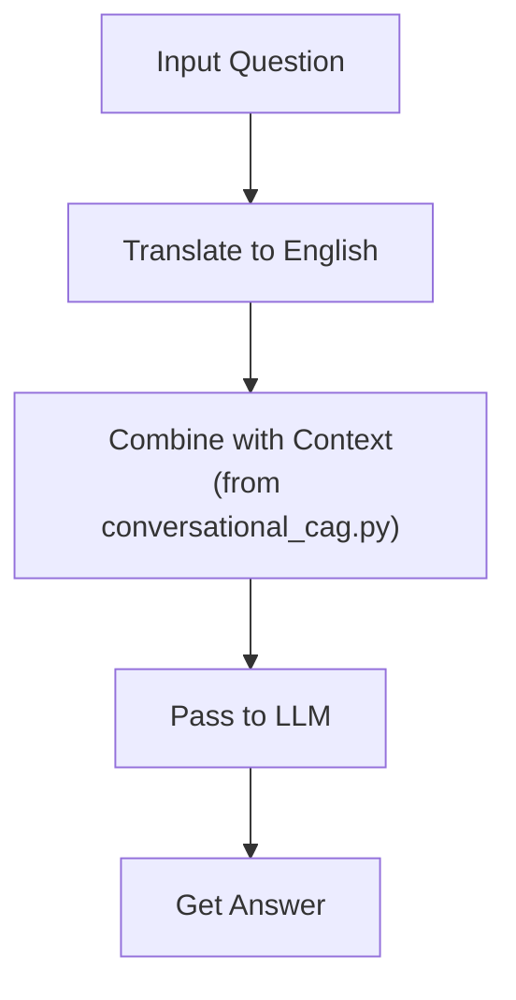

# Chatbot Project

This project provides a chatbot interface with two modes:
- **Web UI**: via `app.py` using Streamlit.
- **CLI**: via `conversational_cag.py`.

## Requirements

- Python 3.8+
- `.env` file with required environment variables (see below)
- `translate-api-python.json` file (for translation API credentials)

## Setup

1. (Recommended) Create and activate a virtual environment:
   ```bash
   python -m venv venv
   # On Windows
   venv\Scripts\activate
   # On Linux/Mac
   source venv/bin/activate
   ```

2. Install dependencies:
   ```bash
   pip install -r requirements.txt
   ```

3. Create a `.env` file in the project root with the following variables:
   ```
   # .env
   OPENROUTER_API_KEY=your_openai_api_key
   # Add other required variables as needed
   ```

4. Place your `translate-api-python.json` file in the project root.

## Running the Project

### Streamlit Web Interface

```bash
streamlit run app.py
```

### Command Line Interface

```bash
python conversational_cag.py
```

## Project Flow



- **Input Question**: User provides a question (any language).
- **Translate to English**: The question is translated to English using the translation API.
- **Combine with Context**: The translated question is combined with context from `conversational_cag.py`.
- **Pass to LLM**: The combined input is sent to a Large Language Model (LLM) for processing.
- **Get Answer**: The LLM returns an answer, which is displayed to the user.

## Notes

- Ensure both `.env` and `translate-api-python.json` are present for the project to work.
- The context used for answering is managed in `conversational_cag.py`.
